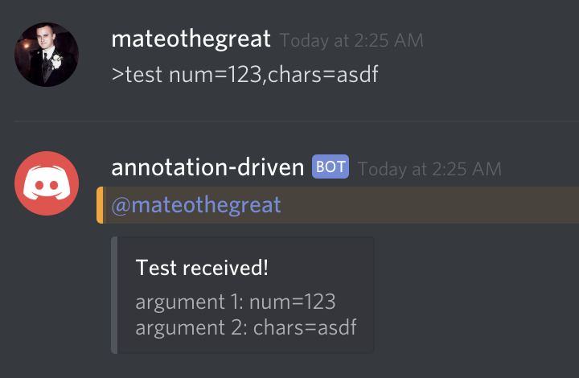
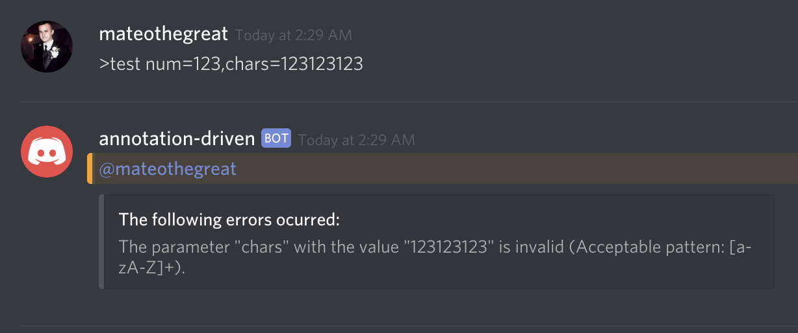

# Getting Setup
This repository comes with a complimentary GitBook to help you get
acquainted with things at https://autobots.matthewdavis.io.
Code documentation can be found at https://discord-bot-typescript-annotationdriven.matthewdavis.io.

## Clone & npm install
```bash
git clone https://github.com/mateothegreat/discord-bot-typescript-annotationdriven
cd discord-bot-typescript-annotationdriven
npm install
```

## Configure .env
Copy the `.env.sample` file to `.env` and replace the defaults with your own. 
Though this repo comes with `.env` added to `.gitignore` be careful and do not commit this file to git!

## Starting the bot
```bash
npm start
```
Example output:
```bash
Command Registerd: *
Command Registerd: >test
Command Registerd: !ping
Bot Started
query: START TRANSACTION
query: SELECT DATABASE() AS `db_name`
query: SELECT * FROM `INFORMATION_SCHEMA`.`TABLES` WHERE (`TABLE_SCHEMA` = 'mybot' AND `TABLE_NAME` = 'user') OR (`TABLE_SCHEMA` = 'mybot' AND `TABLE_NAME` = 'chat_message')
query: SELECT * FROM `INFORMATION_SCHEMA`.`COLUMNS` WHERE (`TABLE_SCHEMA` = 'mybot' AND `TABLE_NAME` = 'user') OR (`TABLE_SCHEMA` = 'mybot' AND `TABLE_NAME` = 'chat_message')
query: SELECT * FROM `INFORMATION_SCHEMA`.`KEY_COLUMN_USAGE` WHERE `CONSTRAINT_NAME` = 'PRIMARY' AND ((`TABLE_SCHEMA` = 'mybot' AND `TABLE_NAME` = 'user') OR (`TABLE_SCHEMA` = 'mybot' AND `TABLE_NAME` = 'chat_message'))
query: SELECT `SCHEMA_NAME`, `DEFAULT_CHARACTER_SET_NAME` as `CHARSET`, `DEFAULT_COLLATION_NAME` AS `COLLATION` FROM `INFORMATION_SCHEMA`.`SCHEMATA`
query: SELECT `s`.* FROM `INFORMATION_SCHEMA`.`STATISTICS` `s` LEFT JOIN `INFORMATION_SCHEMA`.`REFERENTIAL_CONSTRAINTS` `rc` ON `s`.`INDEX_NAME` = `rc`.`CONSTRAINT_NAME` WHERE ((`s`.`TABLE_SCHEMA` = 'mybot' AND `s`.`TABLE_NAME` = 'user') OR (`s`.`TABLE_SCHEMA` = 'mybot' AND `s`.`TABLE_NAME` = 'chat_message')) AND `s`.`INDEX_NAME` != 'PRIMARY' AND `rc`.`CONSTRAINT_NAME` IS NULL
query: SELECT `kcu`.`TABLE_SCHEMA`, `kcu`.`TABLE_NAME`, `kcu`.`CONSTRAINT_NAME`, `kcu`.`COLUMN_NAME`, `kcu`.`REFERENCED_TABLE_SCHEMA`, `kcu`.`REFERENCED_TABLE_NAME`, `kcu`.`REFERENCED_COLUMN_NAME`, `rc`.`DELETE_RULE` `ON_DELETE`, `rc`.`UPDATE_RULE` `ON_UPDATE` FROM `INFORMATION_SCHEMA`.`KEY_COLUMN_USAGE` `kcu` INNER JOIN `INFORMATION_SCHEMA`.`REFERENTIAL_CONSTRAINTS` `rc` ON `rc`.`constraint_name` = `kcu`.`constraint_name` WHERE (`kcu`.`TABLE_SCHEMA` = 'mybot' AND `kcu`.`TABLE_NAME` = 'user') OR (`kcu`.`TABLE_SCHEMA` = 'mybot' AND `kcu`.`TABLE_NAME` = 'chat_message')
query: COMMIT
Connected to database
```

# Creating new Commands
Place a class in the Commands directory annotated with `@Command` 
and it will be picked up dynamically.



```typescript
import { RichEmbed }     from 'discord.js';
import { CommandBase }   from '../Common/CommandBase';
import { Command }       from '../Common/CommandDecorator';
import { CommandParser } from '../Common/CommandParser';

@Command
export class TestCommand extends CommandBase {

    public constructor() {

        //
        // Set this commands configuration.
        //
        super({

            name: '>test',
            description: 'Simple test command that sends a reply if validation succeeds.',
            params: [ {

                name: 'chars',
                description: 'An argument containing a word.',
                required: true,
                pattern: '[a-zA-Z]+'

            }, {

                name: 'num',
                description: 'An argument containing numbers.',
                required: true,
                pattern: '\\d+'

            }, {

                name: 'opt',
                description: 'An optional argument.',
                required: false,

            } ]

        });

    }

    /**
     * Called when a command matches config.name.
     *
     * @param command Parsed out commamd
     *
     */
    public run(command: CommandParser): void {

        command.message.reply(new RichEmbed().setTitle('Test received!')
                                             .setDescription(`argument 1: ${ command.arguments[ 0 ].name }=${ command.arguments[ 0 ].value }\nargument 2: ${ command.arguments[ 1 ].name }=${ command.arguments[ 1 ].value }`));

    }
    
}
```

## Validation Error Example

